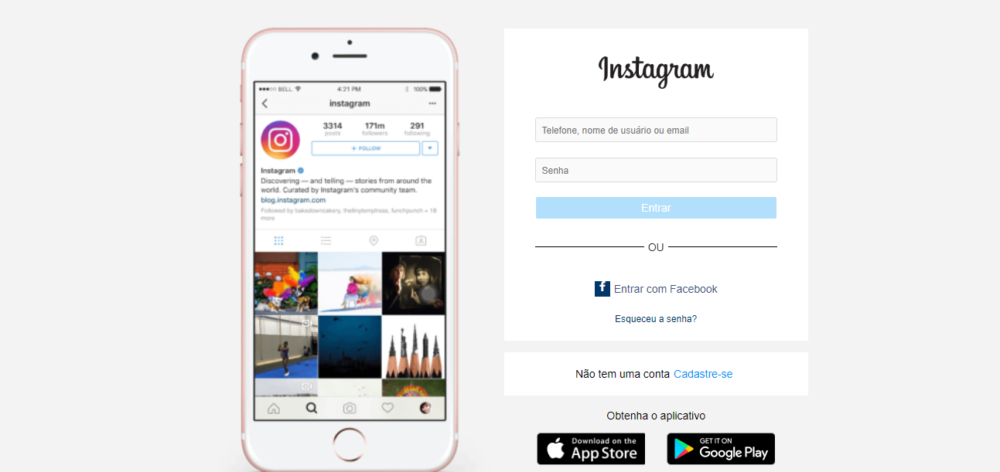
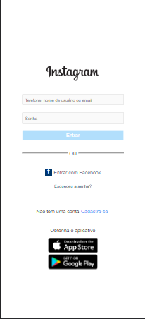

# Clone da página inicial do instagram 🙃

Projeto copiar a tela inicial do instagram
inteiramente responsivo

### Os requisitos são:

* [HTML básico](https://www.w3schools.com/html/)
* [CSS básico](https://developer.mozilla.org/pt-BR/docs/Web/CSS)

